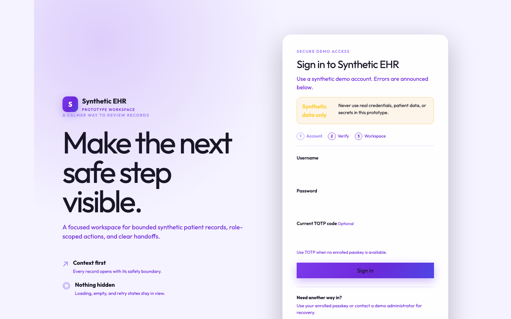
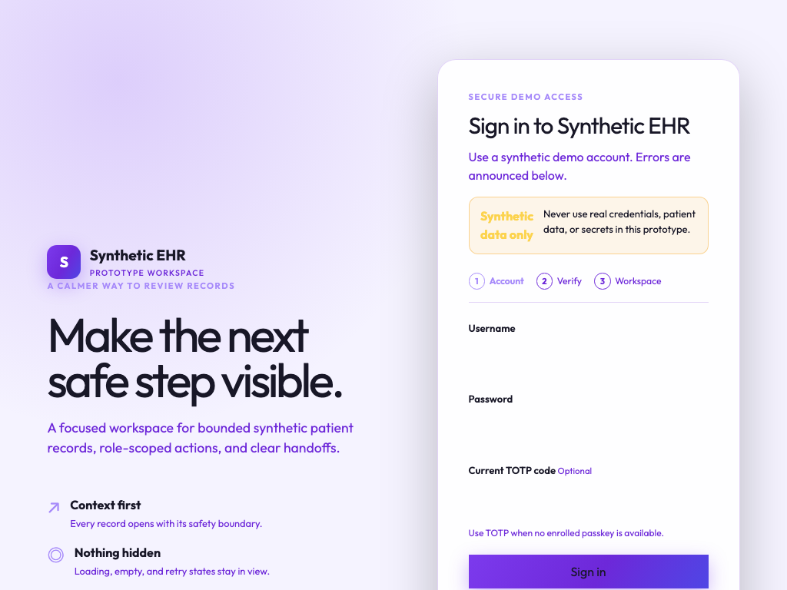
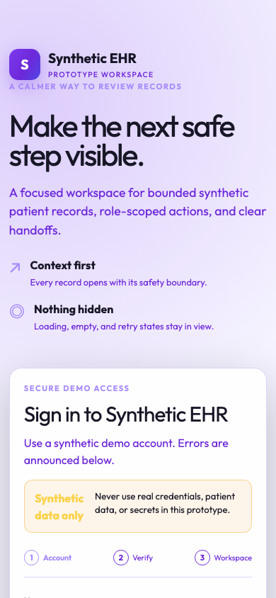
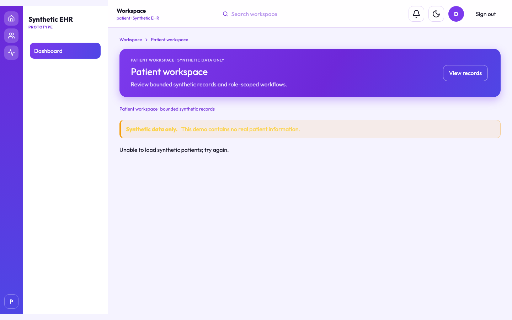
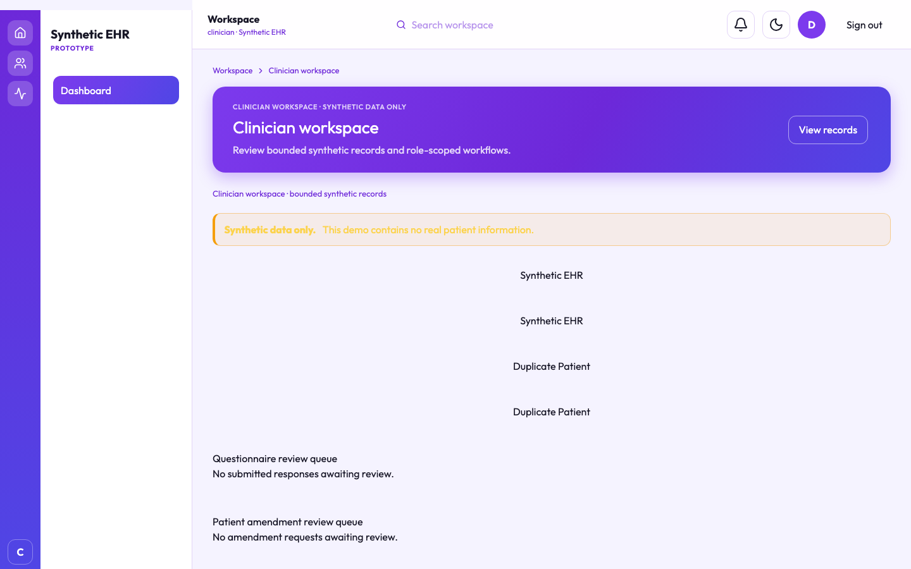
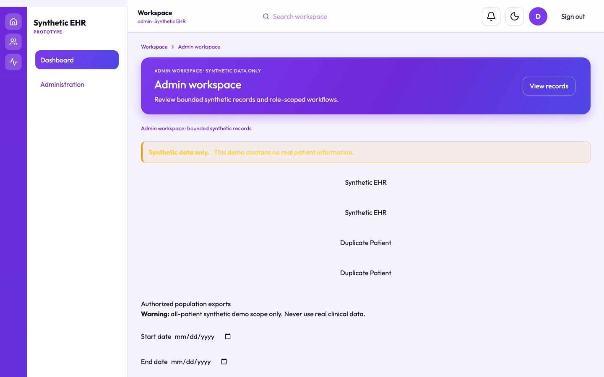
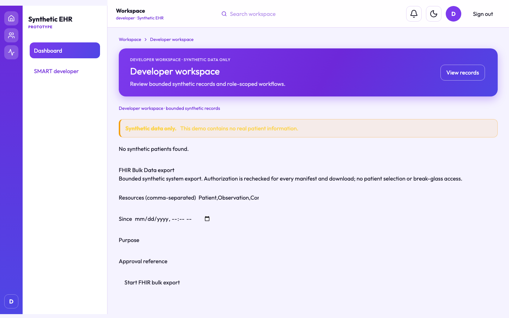
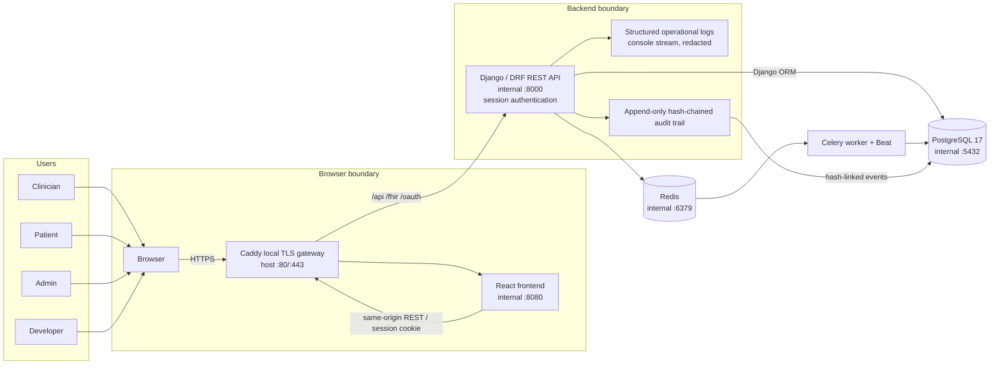
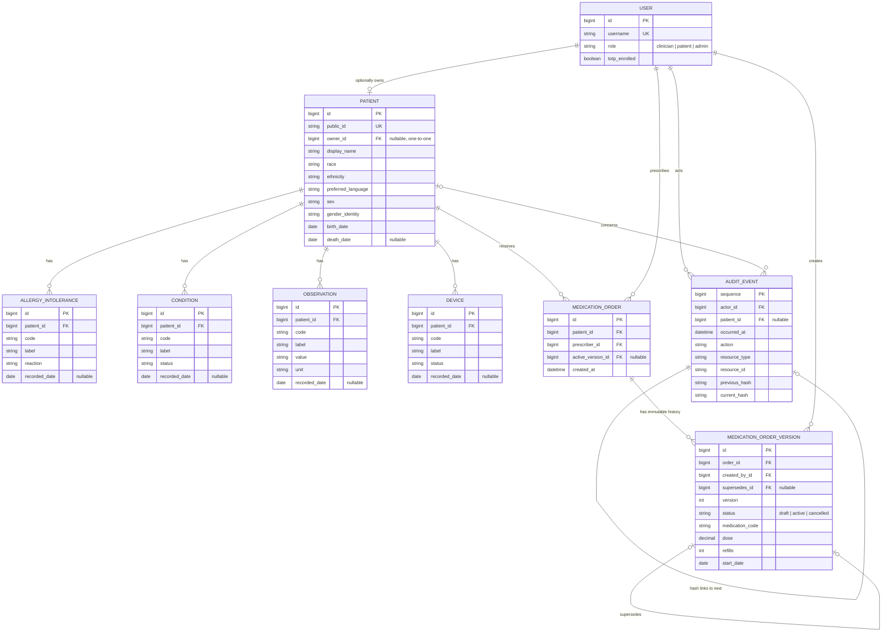
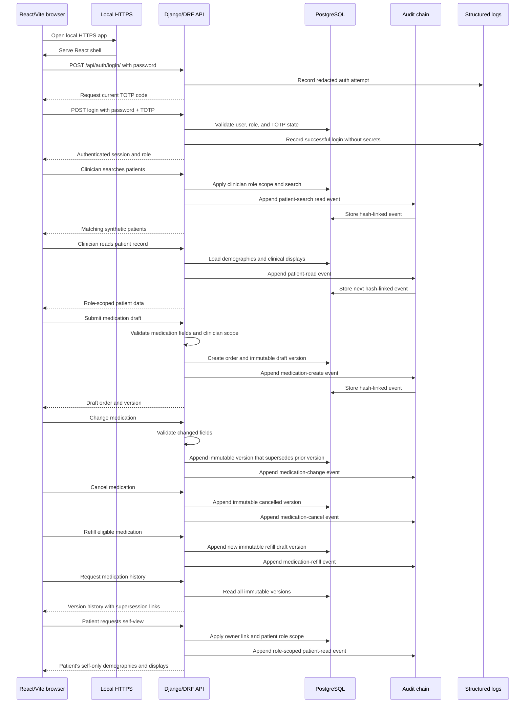

# EHR foundation

> **Synthetic/non-clinical prototype only. Do not use real patient data, real credentials, or this project for clinical care.**
> The records and identities used by the demo are synthetic and are not a medical record system.

This repository is the currently implemented foundation for a small electronic-health-record (EHR) prototype. It combines a Django/DRF API, a React/Vite TypeScript client, and PostgreSQL persistence.

## Current capabilities

- Password authentication with mandatory TOTP and server-side, inactivity-limited sessions.
- Role-scoped patient records for `clinician`, `patient`, and `admin` users.
- Synthetic coded demographics and read-only allergy, condition, observation, and device displays.
- Immutable, hash-chained audit events with an administrator-only report and chain verification endpoint.
- Medication creation, interaction evaluation, explicit acknowledgement, safe signing, change, cancel, refill, immutable history, and audit evidence.
- Read-only FHIR R4 resources plus SMART app registration, consent, PKCE authorization-code exchange, refresh rotation, and launch metadata.
- Durable background jobs with outbox dispatch, bounded retries, idempotency, and safe failure state.
- Direct delivery is a local simulation only: no SMTP, Direct network, or real message is sent; recipient addresses and C-CDA bytes are not exposed in status or logs.
- Family-history, device UDI, questionnaire/terminology, amendment, passkey/recovery, break-glass, and patient-selection workflows with role and audit boundaries.
- Authorized JSON/PDF patient exports and population export jobs with expiry, integrity metadata, and cleanup.
- Idempotent `seed_demo` reset/seed command for clinician, patient, admin, and developer workflows.
- React login, role navigation, loading/empty/error/re-authentication states, keyboard-visible focus, responsive layout, and reduced-motion support.
- Structured operational logging with sensitive values redacted.
- Ticket16 accessibility and prototype safety evidence pack with pinned axe checks,
  semantic shell improvements, hazard/misuse/traceability artifacts, and a deterministic
  manifest validator. Manual keyboard, screen-reader, contrast, and reflow checks remain
  explicitly `Not Run` when browser automation is unavailable.
- Optional Vite HTTPS from developer-supplied certificate paths.
- Declarative demo clinical quality measures with immutable published versions, deterministic snapshot checksums, async runs, and FHIR-style Measure/MeasureReport resources. Quality reports expose population counts only unless a separately authorized subject-level workflow is added.

This remains a local synthetic prototype. The Ticket01–10 Docker Compose platform and the listed P1 workflows are for local synthetic use only; production deployment, real EHI, and other deferred P2 capabilities remain out of scope.

Ticket16 does not claim formal WCAG 2.2 conformance, ISO/FDA/HIPAA certification, or
clinical validation. See `docs/accessibility-conformance-note.md` and
`docs/evidence-manifest-ticket16.json` for bounded evidence and known exceptions.

## Screenshots

These images show the current local demo using synthetic demonstration data only, captured
in the optional light presentation mode. The application remains dark-first by default;
these are illustrative UI captures, not clinical validation or evidence of production
readiness.

| Screen | Viewport | Workflow shown |
| --- | --- | --- |
| [](docs/screenshots/login-mfa.png) | 1440x900 | Optional light-mode presentation of the synthetic account sign-in with mandatory TOTP and non-clinical safety notice. |
| [](docs/screenshots/login-mfa-tablet.png) | 1024x768 | Optional light-mode responsive sign-in capture at tablet width. |
| [](docs/screenshots/login-mfa-mobile.png) | 390x844 | Optional light-mode responsive sign-in capture at mobile width. |
| [](docs/screenshots/patient-workspace.png) | 1440x900 | Optional light-mode patient synthetic record workspace with bounded summary, questionnaire, and amendment surfaces. |
| [](docs/screenshots/clinician-medication-safety.png) | 1440x900 | Optional light-mode clinician record workspace at the medication-order workflow, with the synthetic-data boundary visible. |
| [](docs/screenshots/administrator-audit-jobs.png) | 1440x900 | Optional light-mode administrator quality and append-only audit view; sensitive-looking values are masked in this documentation capture. |
| [](docs/screenshots/developer-smart-fhir.png) | 1440x900 | Optional light-mode developer SMART/FHIR workspace with synthetic-data and browser-storage boundaries. |

The authenticated role captures were taken from the current source Vite server and isolated synthetic backend at 1440x900.

## One-command local HTTPS platform (Ticket01)

The supported demo deployment is Docker Compose. Install Docker Desktop (macOS/Windows) or
Docker Engine with the Compose v2 plugin (Linux), and ensure `docker compose version` works.
No host PostgreSQL, Redis, Python, or Node installation is required for this path. A browser,
`curl`, and a TOTP authenticator are useful for the walkthrough.

Copy `.env.example` to `.env`, replace every `replace-with-...` value with a local value, then run:

```sh
cp .env.example .env
docker compose up --build
```

Caddy is the only service exposed on the host (`http://localhost` redirects to `https://localhost`); web, API, PostgreSQL, Redis, Celery worker, and Beat remain on the internal Compose network. Normal demo Compose defaults are host ports 80/443, while acceptance selects free high host ports via `COMPOSE_HTTP_PORT` and `COMPOSE_HTTPS_PORT` so it never probes or touches an unrelated port-80 process. The API entrypoint applies migrations and idempotently seeds synthetic demo data before Gunicorn starts. Do not place `.env`, certificates, keys, or Caddy's CA files in git.

If ports 80 or 443 are already occupied, choose free host ports explicitly:

```sh
COMPOSE_HTTP_PORT=18080 COMPOSE_HTTPS_PORT=18443 docker compose up --build
```

Use `https://localhost:18443` (and `http://localhost:18080` for the redirect) for that
instance. The same variables can be placed in the shell environment before `docker compose`
commands; they are host-published ports, not service ports.

Caddy creates a local CA in the named `caddy_data` volume. Trust it locally, after the stack is running, by exporting the CA without committing it:

```sh
docker compose cp caddy:/data/caddy/pki/authorities/local/root.crt ./local-caddy-root.crt
```

- macOS: `sudo security add-trusted-cert -d -r trustRoot -k /Library/Keychains/System.keychain ./local-caddy-root.crt`
- Linux (Debian/Ubuntu): `sudo cp ./local-caddy-root.crt /usr/local/share/ca-certificates/ehr-caddy.crt && sudo update-ca-certificates`
- Windows PowerShell: `certutil -addstore -user Root .\local-caddy-root.crt`

Remove the copied certificate when finished. **DESTRUCTIVE:** for a safe reset preview, inspect `docker compose config`; only run `docker compose down --volumes --remove-orphans` against this project when you intend to remove its disposable named volumes. PostgreSQL and Caddy volumes persist across ordinary restarts. Redis is intentionally disposable.

### Ticket17 integrated acceptance

Operational logs are JSON lines with a default-deny field allowlist. Events include canonical event/operation/status/severity fields, correlation and bounded duration metadata; worker events use opaque job references and attempts. Failure diagnostics never include payloads, credentials, identifiers, paths, or raw subprocess stderr.

Run the project-owned acceptance command from the repository root. It checks ports
before startup, creates a uniquely named Compose project, generates an external
temporary env file, enables BuildKit, waits fail-fast for all seven health checks,
exports Caddy's local root CA, validates HTTPS with `curl --cacert`, repeats
migrations/seed, and removes only its own project and volumes in a `finally` block:

```sh
pytest -q backend/tests/test_ticket17_compose.py
```

The default `pytest -q backend/tests/test_ticket17_compose.py` runs the deterministic
Compose/service/port contract without starting containers. Set `EHR_LIVE_COMPOSE=1`
for the live command, which needs
Docker, free host ports 80 and 443, and access to the pinned image/package
registries; a registry outage is reported as **blocked**, never as a fabricated
pass. Do not use `docker compose down -v`, `docker system prune`, or volume-wide
cleanup for this demo. The explicit reset preview/confirmation remains:

```sh
docker compose config                              # dry-run inspection
docker compose down --volumes --remove-orphans     # disposable local stack only
```

The integrated boundary is `Browser → Caddy (80/443) → web/api → PostgreSQL 17 /
Redis → worker/beat`; only Caddy binds host ports. The API owns migration, seed,
authorization, audit-chain, artifact hash/expiry, and redacted structured-log
checks. The browser role flow is patient/clinician/admin/developer; P1 and P2
representatives remain local synthetic fixtures and do not send Direct messages or
use production CDS infrastructure.

For CA trust, export the certificate first:

```sh
docker compose cp caddy:/data/caddy/pki/authorities/local/root.crt ./local-caddy-root.crt
```

- macOS: `sudo security add-trusted-cert -d -r trustRoot -k /Library/Keychains/System.keychain ./local-caddy-root.crt`
- Linux (Debian/Ubuntu): `sudo cp ./local-caddy-root.crt /usr/local/share/ca-certificates/ehr-caddy.crt && sudo update-ca-certificates`
- Windows PowerShell: `certutil -addstore -user Root .\local-caddy-root.crt`

Remove `local-caddy-root.crt` after the demo; it is never a repository artifact.

Check service and worker/Beat health without exposing internal ports:

```sh
docker compose ps
docker compose logs --tail=100 api worker beat
curl --cacert ./local-caddy-root.crt https://localhost/api/health/ready/
curl --cacert ./local-caddy-root.crt https://localhost/api/health/beat/
docker compose restart worker beat
docker compose ps
```

For overridden HTTPS ports, append `:<COMPOSE_HTTPS_PORT>` to both `curl` URLs. Ordinary
`docker compose restart` operations retain PostgreSQL, Caddy, and population-export data in
named volumes. Redis has no persistence by design.

## Architecture

The system flow below shows how each role reaches the committed application boundary and where operational logs and the append-only audit trail go.



The diagram describes the application relationships; `owner` is optional because a patient record may not be
linked to a patient login, and the audit hash link is logical rather than a foreign key.



React/Vite/TypeScript (`src/`) sends same-origin `/api` requests to Django REST
Framework (`backend/`), which uses the Django ORM to persist data in PostgreSQL.
The `backend.users` app owns user roles, sessions, TOTP state, synthetic patient and
clinical records, medication versions, and audit events. `MedicationOrder` is the
stable medication identity; each `MedicationOrderVersion` is append-only, and
`active_version` points to the current version. `AuditEvent` stores the previous and
current hashes so the chain can be verified. Structured operational logs are a
separate console-only observability stream with redaction; they are not clinical
records or audit evidence. The Vite server reads `HTTPS_CERT` and `HTTPS_KEY`;
certificate and key files must remain local.

## Happy flow

This sequence describes the available local demo path, including medication safety/signing
and authorized export boundaries; the patient view is self-only.



The browser is the React client, local HTTPS is provided by the Vite development
server when configured, and every protected read or medication mutation appends an
audit event after authorization. Operational logs remain separate from this audit
path and contain only the redacted structured fields described below.

## Host-development prerequisites

This section is for running Django and Vite outside Compose; use the Compose prerequisites above
for the normal deployment. You need Python 3.12 or a compatible Python for the pinned packages,
Node.js/npm, PostgreSQL with `psql`, and a TOTP authenticator. OpenSSL is needed only when
creating a developer certificate.

## Local environment

From the repository root:

```sh
cp .env.example .env
```

Edit `.env` and replace the placeholders. The supported variables are:

```dotenv
DJANGO_SECRET_KEY=replace-with-a-local-random-value
DJANGO_DEBUG=0
DJANGO_ALLOWED_HOSTS=localhost,127.0.0.1
POSTGRES_DB=ehr
POSTGRES_USER=ehr
POSTGRES_PASSWORD=replace-with-a-local-password
POSTGRES_HOST=127.0.0.1
POSTGRES_PORT=5432
SESSION_INACTIVITY_SECONDS=900
HTTPS_CERT=/absolute/path/to/localhost.crt
HTTPS_KEY=/absolute/path/to/localhost.key
DEMO_PASSWORD=replace-with-a-local-demo-password
EHR_POPULATION_EXPORT_KEY=replace-with-a-local-base64-key
EHR_POPULATION_EXPORT_CAP=10000
```

`DEMO_PASSWORD`, `EHR_POPULATION_EXPORT_KEY`, and `EHR_POPULATION_EXPORT_CAP` are used by the
Compose API/worker path. `HTTPS_CERT` and `HTTPS_KEY` are used only by the host Vite path below;
Compose uses Caddy's internal CA instead. Compose overrides `POSTGRES_HOST` to `postgres` and
the Redis/Celery URLs to the internal service names. The Django settings do not load `.env`
automatically for host commands. Export it before running them (or use an environment loader
already installed on your machine):

```sh
set -a
. ./.env
set +a
```

Do not commit `.env`, passwords, TOTP secrets, certificates, or private keys.

## Host PostgreSQL database

Use a local administrative PostgreSQL connection and substitute only local values for the angle-bracket placeholders. Do not paste production credentials into this file or a shell history.

```sql
CREATE ROLE <local_ehr_role> LOGIN PASSWORD '<local_password>';
CREATE DATABASE <local_ehr_database> OWNER <local_ehr_role>;
```

Set `POSTGRES_USER`, `POSTGRES_PASSWORD`, and `POSTGRES_DB` in `.env` to those same local values. If the role or database already exists, do not run the `CREATE` statements again; connect with `psql` and verify the existing local configuration instead.

## Host backend install, migrate, and run

```sh
python3 -m venv .venv
. .venv/bin/activate
python3 -m pip install -r requirements.txt

set -a
. ./.env
set +a
python3 backend/manage.py migrate
python3 backend/manage.py runserver 127.0.0.1:8000
```

The deterministic `seed_demo` command creates four local-only accounts, `P001`/`P002`, synthetic clinical rows, read-only devices, a baseline medication, interaction rules, and the alert floor. It is safe to run repeatedly. Passwords are supplied at runtime; the command never prints or logs TOTP secrets.

```sh
export DEMO_PASSWORD='choose-a-local-demo-password'
python3 backend/manage.py migrate
python3 backend/manage.py seed_demo
# Remove and recreate only demo-owned rows:
python3 backend/manage.py seed_demo --reset
# Explicit local enrollment (writes secrets only to this mode-600 file):
python3 backend/manage.py seed_demo --totp-secret-file "$HOME/.ehr-demo-totp"
```

Without `--totp-secret-file`, seeded accounts remain pending enrollment. The explicit option writes one-time local enrollment material to a mode-600 file; protect and delete it after configuring an authenticator. Existing TOTP secrets are retained and never printed again. For an already authenticated account, `/api/auth/enroll/` followed by `/api/auth/enroll/verify/` is also supported; never commit the returned secret.

For Compose, migration and ordinary seeding happen automatically in the API entrypoint. To
repeat them without rebuilding, run:

```sh
docker compose exec api sh -c 'python /app/backend/manage.py migrate --noinput && python /app/backend/manage.py seed_demo --password "$DEMO_PASSWORD"'
docker compose exec api python /app/backend/manage.py migrate --check
```

`seed_demo --reset` is explicitly destructive to demo-owned database rows; use it only when
you intend to recreate the synthetic fixtures. For Compose enrollment, write the one-time file
inside the API container, copy it to a protected local path, configure the authenticator, and
remove both copies:

```sh
docker compose exec api sh -c 'python /app/backend/manage.py seed_demo --password "$DEMO_PASSWORD" --totp-secret-file /tmp/ehr-demo-totp'
docker compose cp api:/tmp/ehr-demo-totp "$HOME/.ehr-demo-totp"
docker compose exec api rm -f /tmp/ehr-demo-totp
chmod 600 "$HOME/.ehr-demo-totp"
```

## Demo login and ten-minute walkthrough

The seed accounts are `demo-clinician`, `demo-patient`, `demo-admin`, and `demo-developer`, all using the runtime `DEMO_PASSWORD`. The API login requires `username`, `password`, and the current six-digit `otp`:

```sh
curl -i -c /tmp/ehr-demo.cookies \
  --cacert ./local-caddy-root.crt \
  -H 'Content-Type: application/json' \
  -d '{"username":"demo-clinician","password":"<choose-local-password>","otp":"<current-six-digit-otp>"}' \
  https://localhost/api/auth/login/
```

For host development use `http://127.0.0.1:8000`; for a Compose port override use
`https://localhost:<COMPOSE_HTTPS_PORT>` and the exported Caddy CA.

1. Start Compose (or start PostgreSQL, export `.env`, migrate, and run `seed_demo` for host development).
2. Complete TOTP enrollment for each account, then sign in with the current six-digit code. After a TOTP-authenticated browser session, optionally register a WebAuthn/passkey credential and use passkey login; TOTP remains the fallback.
3. As clinician, open `P001`, create an `AMOX` draft, evaluate the synthetic allergy/drug alert, acknowledge a non-critical finding or observe the critical block, and sign only after the UI permits it. Inspect immutable history and audit events.
4. As patient, sign in to view only `P001`; request JSON and PDF downloads and compare displayed SHA-256 values with `sha256sum`.
5. As admin, review the paginated audit report, verify the chain, manage users, and set the LOW/MODERATE/HIGH floor.
6. As developer, open the SMART workspace and follow the authorization/consent steps below; use `python3 backend/manage.py smart_demo` for host development or `docker compose exec api python /app/backend/manage.py smart_demo ...` in Compose.

Useful routes include `/api/auth/session/`, `/api/patients/P001/`, `/api/audit/verify/`, `/.well-known/smart-configuration`, `/oauth/authorize/`, `/oauth/token/`, and `/fhir/R4/Patient/P001`.

### Representative P0/P1/P2 checks

- **P0:** clinician medication lifecycle and interaction alert on `P001`; patient self-view and
  JSON/PDF export; admin audit-chain verification and severity floor; developer SMART consent and
  bounded FHIR Patient read. These are synthetic flows only.
- **P1:** family-history correction, UDI device parsing, questionnaire submission/review,
  amendment, and bounded population export. Use the matching rows in
  `docs/test-cases/ehr-p1-p2-compose.csv` for exact preconditions and expected boundaries.
- **P2:** local CDS Hooks discovery/invocation, C-CDA generation, simulated Direct delivery, and
  FHIR Bulk export. No message is sent to a real network and no production CDS infrastructure is
  used.

## SMART developer demo

Register through an authenticated developer session (the browser is intentionally required for consent). Use a fresh PKCE verifier and its S256 challenge; keep the returned client secret and tokens out of logs and source control.

```sh
curl -b /tmp/ehr-demo.cookies -c /tmp/ehr-demo.cookies -H 'Content-Type: application/json' \
  --cacert ./local-caddy-root.crt \
  -d '{"name":"Local synthetic client","redirect_uris":["https://localhost/callback"],"scope":"openid fhirUser patient/Patient.r patient/MedicationRequest.r patient/AllergyIntolerance.r patient/Condition.r patient/Observation.r patient/Device.r"}' \
  https://localhost/api/smart/apps/
curl -b /tmp/ehr-demo.cookies -H 'Content-Type: application/json' \
  --cacert ./local-caddy-root.crt \
  -d '{"client_id":"<client-id>","redirect_uri":"https://localhost/callback","scope":"openid fhirUser patient/Patient.r","code_challenge":"<S256-challenge>","code_challenge_method":"S256","patient":"P001","decision":"approve","state":"demo"}' \
  https://localhost/oauth/authorize/
python3 backend/manage.py smart_demo --base-url https://localhost --client-id '<client-id>' --client-secret '<one-time-secret>' --code '<returned-code>' --verifier '<original-verifier>'
```

The sample client performs authorization-code exchange, refresh rotation, and a Patient read while keeping token values in memory. It does not bypass the explicit consent screen. For host development, use the original `http://127.0.0.1:8000` base URL and endpoints instead.

## Optional host frontend install and run

The Compose web container is a built nginx image and does not run the Vite development server.
Use this section only for host development, with Django running on `127.0.0.1:8000`.

In a second terminal, from the repository root:

```sh
npm install
npm run dev
```

The Vite server normally listens on `http://localhost:5173`. For local HTTPS, point it at certificate files outside the repository:

```sh
HTTPS_CERT=/absolute/path/to/localhost.crt \
HTTPS_KEY=/absolute/path/to/localhost.key \
npm run dev
```

One possible local certificate setup, using files ignored by this repository, is:

```sh
mkdir -p .local-certs
openssl req -x509 -newkey rsa:2048 -nodes -days 365 \
  -keyout .local-certs/localhost.key \
  -out .local-certs/localhost.crt \
  -subj '/CN=localhost'
```

Then use `HTTPS_CERT="$PWD/.local-certs/localhost.crt"` and `HTTPS_KEY="$PWD/.local-certs/localhost.key"`. Your browser will need to accept the locally self-signed certificate. Never commit `.local-certs/` or any private key.

## Verification commands

Backend tests use pytest-django and the configured PostgreSQL settings:

```sh
set -a; . ./.env; set +a
python3 -m pytest
```

Frontend checks are the scripts declared in `package.json`:

```sh
npm test
npm run lint
npm run build
```

The acceptance matrix is `docs/test-cases/ehr-mvp-p0.csv` (exactly 18 columns); Ticket10 final integration scenarios are TC-EHR-0092 through TC-EHR-0096. Frontend checks cover TypeScript and the no-browser-storage boundary. When a local browser test runner is available, run the core keyboard/focus and reduced-motion checks against the HTTPS shell; this repository does not install browser tooling or network dependencies during verification.

The deterministic Compose contract is also safe without starting containers:

```sh
docker compose config -q
python3 -m pytest -q backend/tests/test_ticket17_compose.py
```

Set `EHR_LIVE_COMPOSE=1` only for live acceptance. It needs Docker, free high host ports, and
registry/package-index access; it creates an isolated temporary environment, validates the
exported Caddy CA, repeats migration/seed, checks all seven health checks, restarts the worker,
and cleans up only its own project. A registry or package-index outage is **blocked**, not a pass.

## Troubleshooting

- **Database connection refused or authentication failed:** confirm PostgreSQL is running and that `.env` values match the local role/database; rerun `python3 backend/manage.py migrate` after fixing them.
- **`No module named ...`:** activate `.venv` and rerun `python3 -m pip install -r requirements.txt`.
- **Login returns MFA/enrollment errors:** accounts must have `totp_enrolled=True` and the current authenticator code. Re-run the local setup command if a secret was lost.
- **No patients appear:** authenticate first and run `python3 backend/manage.py seed_demo`.
- **Frontend `/api` requests fail:** confirm Django is listening on `127.0.0.1:8000`; Vite proxies `/api`, `/oauth`, `/fhir`, and discovery routes to it.
- **HTTPS fails to start:** verify both `HTTPS_CERT` and `HTTPS_KEY` point to readable matching files. Keep keys outside version control.
- **Tests fail against PostgreSQL:** export `.env`, ensure the configured database exists, and run migrations before pytest.
- **Docker registry, npm, or PyPI pull/build failure:** retry after confirming connectivity and any required proxy or corporate CA configuration. Use `docker compose build --progress=plain --pull`, or bounded PyPI retries such as `docker compose build --build-arg PIP_INSTALL_TIMEOUT=120 --build-arg PIP_INSTALL_RETRIES=8`. Do not disable TLS verification, substitute an untrusted index, or claim a clean rebuild while registry access is blocked.
- **Need status or diagnostics:** use `docker compose ps` and `docker compose logs --tail=100 caddy web api postgres redis worker beat`; inspect only redacted JSON operational events. Do not use `docker system prune` or volume-wide cleanup.

Operational logs are emitted to the console as structured events. They intentionally redact passwords, OTP/TOTP values, tokens, cookies, patient/clinical payloads, and other sensitive fields; do not work around that redaction by logging secrets.
# CDS Hooks demo (Ticket 13)

The local `/api/cds-services/` discovery and invocation endpoints expose deterministic, CDS Hooks-shaped medication-prescribe/order-sign and patient-view cards. This is **non-clinical demo decision support**: cards are reminders only, never silently mutate records, and their evidence links contain no patient content. Clinicians can accept, dismiss, or override cards; configured safety-critical dismissals and overrides require a reason. Administrators activate or retire immutable rule versions.

### FHIR Bulk Data-style export (Ticket15)

Administrators and authorized SMART system tokens can use `GET` or `POST /fhir/R4/$export` with an allowlisted `_type`, optional `_since`, `purpose`, `approval`, and `Idempotency-Key`. The endpoint returns `202` and an opaque `Content-Location`; poll it for a bounded manifest, then download per-resource `application/fhir+ndjson` entries. Files are AES-GCM encrypted at rest, SHA-256 verified, randomized, capped at 100 MB, and expire after 24 hours. This synthetic demo intentionally has no patient selection/break-glass path and is not a full SMART Backend Services assertion flow.


## Contact

For any questions or inquiries, please reach out to www.linkedin.com/in/agudatech/.

## Support

If you find this project helpful and would like to support its ongoing development, consider buying me a coffee! Your support helps me keep working on this project and developing more features.

[](https://www.buymeacoffee.com/mauriceague)

    
