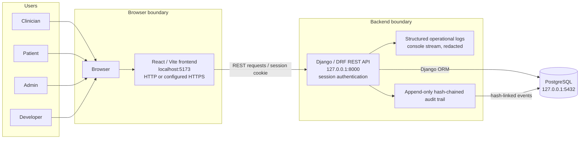
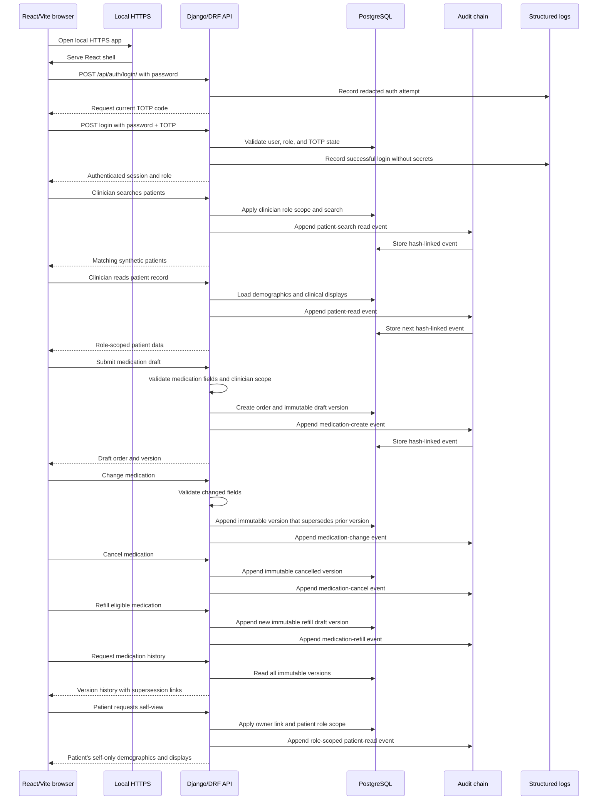

# EHR foundation

> **Synthetic/non-clinical prototype only. Do not use real patient data, real credentials, or this project for clinical care.**
> The records and identities used by the demo are synthetic and are not a medical record system.

This repository is the currently implemented foundation for a small electronic-health-record (EHR) prototype. It combines a Django/DRF API, a React/Vite TypeScript client, and PostgreSQL persistence.

## Current capabilities

- Password authentication with mandatory TOTP and server-side, inactivity-limited sessions.
- Role-scoped patient records for `clinician`, `patient`, and `admin` users.
- Synthetic coded demographics and read-only allergy, condition, observation, and device displays.
- Immutable, hash-chained audit events with an administrator-only report and chain verification endpoint.
- Medication creation, interaction evaluation, explicit acknowledgement, safe signing, change, cancel, refill, immutable history, and audit evidence.
- Read-only FHIR R4 resources plus SMART app registration, consent, PKCE authorization-code exchange, refresh rotation, and launch metadata.
- Idempotent `seed_demo` reset/seed command for clinician, patient, admin, and developer workflows.
- React login, role navigation, loading/empty/error/re-authentication states, keyboard-visible focus, responsive layout, and reduced-motion support.
- Structured operational logging with sensitive values redacted.
- Optional Vite HTTPS from developer-supplied certificate paths.

This remains a local synthetic prototype. Docker, production deployment, real EHI, population export, and other P1/P2 capabilities are intentionally out of scope.

## Architecture

The system flow below shows how each role reaches the committed application boundary and where operational logs and the append-only audit trail go.



The diagram describes the application relationships; `owner` is optional because a patient record may not be
linked to a patient login, and the audit hash link is logical rather than a foreign key.


React/Vite/TypeScript (`src/`) sends same-origin `/api` requests to Django REST
Framework (`backend/`), which uses the Django ORM to persist data in PostgreSQL.
The `backend.users` app owns user roles, sessions, TOTP state, synthetic patient and
clinical records, medication versions, and audit events. `MedicationOrder` is the
stable medication identity; each `MedicationOrderVersion` is append-only, and
`active_version` points to the current version. `AuditEvent` stores the previous and
current hashes so the chain can be verified. Structured operational logs are a
separate console-only observability stream with redaction; they are not clinical
records or audit evidence. The Vite server reads `HTTPS_CERT` and `HTTPS_KEY`;
certificate and key files must remain local.

## Happy flow

This sequence describes the available local demo path. It intentionally stops short
of medication signing and does not include exports or interaction signing; the
patient view is self-only.



The browser is the React client, local HTTPS is provided by the Vite development
server when configured, and every protected read or medication mutation appends an
audit event after authorization. Operational logs remain separate from this audit
path and contain only the redacted structured fields described below.

## Prerequisites

- Python 3 and the interpreter supported by the pinned project dependencies (Django 5+).
- Node.js and npm (the frontend uses the npm scripts in `package.json`).
- PostgreSQL with `psql` available locally.
- OpenSSL only if generating a local development certificate.
- A TOTP authenticator for the account secret printed during setup.

## Local environment

From the repository root:

```sh
cp .env.example .env
```

Edit `.env` and replace the placeholders. The supported variables are:

```dotenv
DJANGO_SECRET_KEY=replace-with-a-local-random-value
DJANGO_DEBUG=0
DJANGO_ALLOWED_HOSTS=localhost,127.0.0.1
POSTGRES_DB=ehr
POSTGRES_USER=ehr
POSTGRES_PASSWORD=replace-with-a-local-password
POSTGRES_HOST=127.0.0.1
POSTGRES_PORT=5432
SESSION_INACTIVITY_SECONDS=900
HTTPS_CERT=/absolute/path/to/localhost.crt
HTTPS_KEY=/absolute/path/to/localhost.key
```

The Django settings do not load `.env` automatically. Export it before running commands (or use an environment loader already installed on your machine):

```sh
set -a
. ./.env
set +a
```

Do not commit `.env`, passwords, TOTP secrets, certificates, or private keys.

## PostgreSQL database

Use a local administrative PostgreSQL connection and substitute only local values for the angle-bracket placeholders. Do not paste production credentials into this file or a shell history.

```sql
CREATE ROLE <local_ehr_role> LOGIN PASSWORD '<local_password>';
CREATE DATABASE <local_ehr_database> OWNER <local_ehr_role>;
```

Set `POSTGRES_USER`, `POSTGRES_PASSWORD`, and `POSTGRES_DB` in `.env` to those same local values. If the role or database already exists, do not run the `CREATE` statements again; connect with `psql` and verify the existing local configuration instead.

## Backend install, migrate, and run

```sh
python3 -m venv .venv
. .venv/bin/activate
python3 -m pip install -r requirements.txt

set -a
. ./.env
set +a
python3 backend/manage.py migrate
python3 backend/manage.py runserver 127.0.0.1:8000
```

The deterministic `seed_demo` command creates four local-only accounts, `P001`/`P002`, synthetic clinical rows, read-only devices, a baseline medication, interaction rules, and the alert floor. It is safe to run repeatedly. Passwords are supplied at runtime; the command never prints or logs TOTP secrets.

```sh
export DEMO_PASSWORD='choose-a-local-demo-password'
python3 backend/manage.py migrate
python3 backend/manage.py seed_demo
# Remove and recreate only demo-owned rows:
python3 backend/manage.py seed_demo --reset
# Explicit local enrollment (writes secrets only to this mode-600 file):
python3 backend/manage.py seed_demo --totp-secret-file "$HOME/.ehr-demo-totp"
```

Without `--totp-secret-file`, seeded accounts remain pending enrollment. The explicit option writes one-time local enrollment material to a mode-600 file; protect and delete it after configuring an authenticator. Existing TOTP secrets are retained and never printed again. For an already authenticated account, `/api/auth/enroll/` followed by `/api/auth/enroll/verify/` is also supported; never commit the returned secret.

## Demo login and ten-minute walkthrough

The seed accounts are `demo-clinician`, `demo-patient`, `demo-admin`, and `demo-developer`, all using the runtime `DEMO_PASSWORD`. The API login requires `username`, `password`, and the current six-digit `otp`:

```sh
curl -i -c /tmp/ehr-demo.cookies \
  -H 'Content-Type: application/json' \
  -d '{"username":"demo-clinician","password":"<choose-local-password>","otp":"<current-six-digit-otp>"}' \
  http://127.0.0.1:8000/api/auth/login/
```

1. Start PostgreSQL, export `.env`, migrate, and run `seed_demo`.
2. Start Django and Vite, then sign in with a seeded account and current TOTP.
3. As clinician, open `P001`, create an `AMOX` draft, evaluate the synthetic allergy/drug alert, acknowledge a non-critical finding or observe the critical block, and sign only after the UI permits it. Inspect immutable history and audit events.
4. As patient, sign in to view only `P001`; request JSON and PDF downloads and compare displayed SHA-256 values with `sha256sum`.
5. As admin, review the paginated audit report, verify the chain, manage users, and set the LOW/MODERATE/HIGH floor.
6. As developer, open the SMART workspace and follow the authorization/consent steps below; use `scripts/smart_demo.py` for token refresh and bounded FHIR Patient read.

Useful routes include `/api/auth/session/`, `/api/patients/P001/`, `/api/audit/verify/`, `/.well-known/smart-configuration`, `/oauth/authorize/`, `/oauth/token/`, and `/fhir/R4/Patient/P001`.

## SMART developer demo

Register through an authenticated developer session (the browser is intentionally required for consent). Use a fresh PKCE verifier and its S256 challenge; keep the returned client secret and tokens out of logs and source control.

```sh
curl -b /tmp/ehr-demo.cookies -c /tmp/ehr-demo.cookies -H 'Content-Type: application/json' \
  -d '{"name":"Local synthetic client","redirect_uris":["https://localhost/callback"],"scope":"openid fhirUser patient/Patient.r patient/MedicationRequest.r patient/AllergyIntolerance.r patient/Condition.r patient/Observation.r patient/Device.r"}' \
  http://127.0.0.1:8000/api/smart/apps/
curl -b /tmp/ehr-demo.cookies -H 'Content-Type: application/json' \
  -d '{"client_id":"<client-id>","redirect_uri":"https://localhost/callback","scope":"openid fhirUser patient/Patient.r","code_challenge":"<S256-challenge>","code_challenge_method":"S256","patient":"P001","decision":"approve","state":"demo"}' \
  http://127.0.0.1:8000/oauth/authorize/
python3 scripts/smart_demo.py --base-url http://127.0.0.1:8000 --client-id '<client-id>' --client-secret '<one-time-secret>' --code '<returned-code>' --verifier '<original-verifier>'
```

The sample client performs authorization-code exchange, refresh rotation, and a Patient read while keeping token values in memory. It does not bypass the explicit consent screen.

## Frontend install and run

In a second terminal, from the repository root:

```sh
npm install
npm run dev
```

The Vite server normally listens on `http://localhost:5173`. For local HTTPS, point it at certificate files outside the repository:

```sh
HTTPS_CERT=/absolute/path/to/localhost.crt \
HTTPS_KEY=/absolute/path/to/localhost.key \
npm run dev
```

One possible local certificate setup, using files ignored by this repository, is:

```sh
mkdir -p .local-certs
openssl req -x509 -newkey rsa:2048 -nodes -days 365 \
  -keyout .local-certs/localhost.key \
  -out .local-certs/localhost.crt \
  -subj '/CN=localhost'
```

Then use `HTTPS_CERT="$PWD/.local-certs/localhost.crt"` and `HTTPS_KEY="$PWD/.local-certs/localhost.key"`. Your browser will need to accept the locally self-signed certificate. Never commit `.local-certs/` or any private key.

## Verification commands

Backend tests use pytest-django and the configured PostgreSQL settings:

```sh
set -a; . ./.env; set +a
python3 -m pytest
```

Frontend checks are the scripts declared in `package.json`:

```sh
npm test
npm run lint
npm run build
```

The acceptance matrix is `docs/test-cases/ehr-mvp-p0.csv` (exactly 18 columns); Ticket10 final integration scenarios are TC-EHR-0092 through TC-EHR-0096. Frontend checks cover TypeScript and the no-browser-storage boundary. When a local browser test runner is available, run the core keyboard/focus and reduced-motion checks against the HTTPS shell; this repository does not install browser tooling or network dependencies during verification.

## Troubleshooting

- **Database connection refused or authentication failed:** confirm PostgreSQL is running and that `.env` values match the local role/database; rerun `python3 backend/manage.py migrate` after fixing them.
- **`No module named ...`:** activate `.venv` and rerun `python3 -m pip install -r requirements.txt`.
- **Login returns MFA/enrollment errors:** accounts must have `totp_enrolled=True` and the current authenticator code. Re-run the local setup command if a secret was lost.
- **No patients appear:** authenticate first and run `python3 backend/manage.py seed_demo`.
- **Frontend `/api` requests fail:** confirm Django is listening on `127.0.0.1:8000`; Vite proxies `/api`, `/oauth`, `/fhir`, and discovery routes to it.
- **HTTPS fails to start:** verify both `HTTPS_CERT` and `HTTPS_KEY` point to readable matching files. Keep keys outside version control.
- **Tests fail against PostgreSQL:** export `.env`, ensure the configured database exists, and run migrations before pytest.

Operational logs are emitted to the console as structured events. They intentionally redact passwords, OTP/TOTP values, tokens, cookies, patient/clinical payloads, and other sensitive fields; do not work around that redaction by logging secrets.
