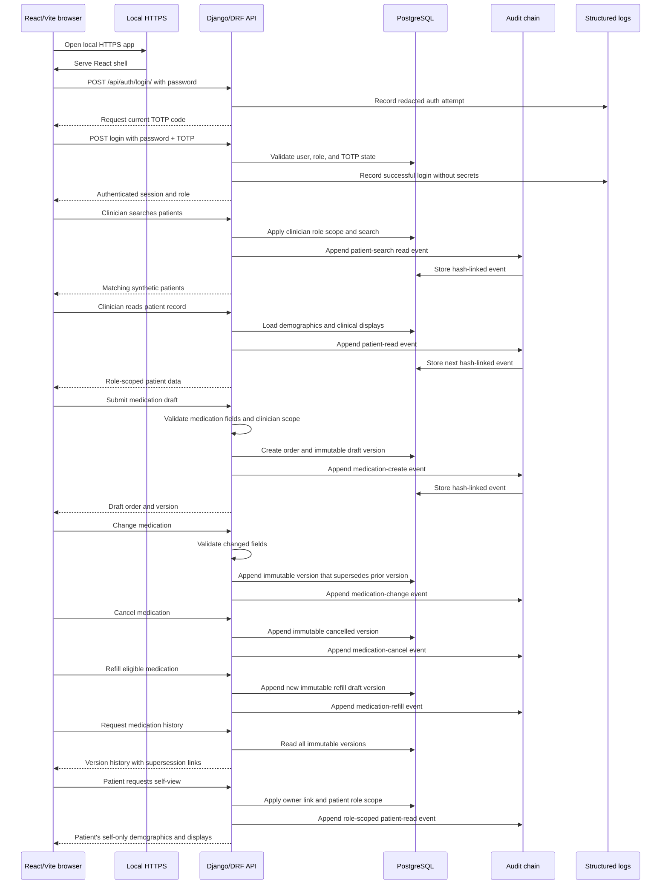

# EHR foundation

> **Synthetic/non-clinical prototype only. Do not use real patient data, real credentials, or this project for clinical care.**
> The records and identities used by the demo are synthetic and are not a medical record system.

This repository is the currently implemented Tickets 01–04 foundation for a small electronic-health-record (EHR) prototype. It combines a Django/DRF API, a React/Vite TypeScript client, and PostgreSQL persistence.

## Current capabilities

- Password authentication with mandatory TOTP and server-side, inactivity-limited sessions.
- Role-scoped patient records for `clinician`, `patient`, and `admin` users.
- Synthetic coded demographics and read-only allergy, condition, observation, and device displays.
- Immutable, hash-chained audit events with an administrator-only report and chain verification endpoint.
- Medication draft creation plus immutable change, cancel, refill, and history versions. Medication signing is intentionally unavailable.
- Structured operational logging with sensitive values redacted.
- Optional Vite HTTPS from developer-supplied certificate paths.

Not complete in this state: interaction signing (Ticket 05), FHIR, SMART on FHIR, exports, and Docker Compose. There is also no repository seed command or built-in demo account, and the React client currently has no login/enrollment screen or Vite proxy for `/api`.

## Architecture

The committed Tickets01–04 data model is shown below. The diagram describes the
application relationships; `owner` is optional because a patient record may not be
linked to a patient login, and the audit hash link is logical rather than a foreign key.


React/Vite/TypeScript (`src/`) sends same-origin `/api` requests to Django REST
Framework (`backend/`), which uses the Django ORM to persist data in PostgreSQL.
The `backend.users` app owns user roles, sessions, TOTP state, synthetic patient and
clinical records, medication versions, and audit events. `MedicationOrder` is the
stable medication identity; each `MedicationOrderVersion` is append-only, and
`active_version` points to the current version. `AuditEvent` stores the previous and
current hashes so the chain can be verified. Structured operational logs are a
separate console-only observability stream with redaction; they are not clinical
records or audit evidence. The Vite server reads `HTTPS_CERT` and `HTTPS_KEY`;
certificate and key files must remain local.

## Happy flow

This sequence describes the available local demo path. It intentionally stops short
of medication signing and does not include exports or interaction signing; the
patient view is self-only.



The browser is the React client, local HTTPS is provided by the Vite development
server when configured, and every protected read or medication mutation appends an
audit event after authorization. Operational logs remain separate from this audit
path and contain only the redacted structured fields described below.

## Prerequisites

- Python 3 and the interpreter supported by the pinned project dependencies (Django 5+).
- Node.js and npm (the frontend uses the npm scripts in `package.json`).
- PostgreSQL with `psql` available locally.
- OpenSSL only if generating a local development certificate.
- A TOTP authenticator for the account secret printed during setup.

## Local environment

From the repository root:

```sh
cp .env.example .env
```

Edit `.env` and replace the placeholders. The supported variables are:

```dotenv
DJANGO_SECRET_KEY=replace-with-a-local-random-value
DJANGO_DEBUG=0
DJANGO_ALLOWED_HOSTS=localhost,127.0.0.1
POSTGRES_DB=ehr
POSTGRES_USER=ehr
POSTGRES_PASSWORD=replace-with-a-local-password
POSTGRES_HOST=127.0.0.1
POSTGRES_PORT=5432
SESSION_INACTIVITY_SECONDS=900
HTTPS_CERT=/absolute/path/to/localhost.crt
HTTPS_KEY=/absolute/path/to/localhost.key
```

The Django settings do not load `.env` automatically. Export it before running commands (or use an environment loader already installed on your machine):

```sh
set -a
. ./.env
set +a
```

Do not commit `.env`, passwords, TOTP secrets, certificates, or private keys.

## PostgreSQL database

Use a local administrative PostgreSQL connection and substitute only local values for the angle-bracket placeholders. Do not paste production credentials into this file or a shell history.

```sql
CREATE ROLE <local_ehr_role> LOGIN PASSWORD '<local_password>';
CREATE DATABASE <local_ehr_database> OWNER <local_ehr_role>;
```

Set `POSTGRES_USER`, `POSTGRES_PASSWORD`, and `POSTGRES_DB` in `.env` to those same local values. If the role or database already exists, do not run the `CREATE` statements again; connect with `psql` and verify the existing local configuration instead.

## Backend install, migrate, and run

```sh
python3 -m venv .venv
. .venv/bin/activate
python3 -m pip install -r requirements.txt

set -a
. ./.env
set +a
python3 backend/manage.py migrate
python3 backend/manage.py runserver 127.0.0.1:8000
```

There are no custom Django management commands or seed command. The two synthetic patient records (`P001` and `P002`) and their synthetic clinical display rows are created lazily by authenticated patient requests.

## Demo users and TOTP setup

The codebase does not ship demo users. Create local-only users with a password you choose; the command below generates a different TOTP secret for each account and prints the secrets once so they can be added to an authenticator. Replace `<choose-local-password>`; do not use a real password.

```sh
DEMO_PASSWORD='<choose-local-password>' python3 backend/manage.py shell <<'PY'
import os
import pyotp
from backend.users.models import User

for username, role in (
    ("demo-clinician", User.Role.CLINICIAN),
    ("demo-patient", User.Role.PATIENT),
    ("demo-admin", User.Role.ADMIN),
):
    user, _ = User.objects.get_or_create(username=username)
    user.set_password(os.environ["DEMO_PASSWORD"])
    user.role = role
    user.totp_secret = pyotp.random_base32()
    user.totp_enrolled = True
    user.save()
    print(f"{username}: {user.totp_secret}")
PY
```

Add each printed secret to a local TOTP authenticator. The API login requires `username`, `password`, and the current six-digit `otp`:

```sh
curl -i -c /tmp/ehr-demo.cookies \
  -H 'Content-Type: application/json' \
  -d '{"username":"demo-clinician","password":"<choose-local-password>","otp":"<current-six-digit-otp>"}' \
  http://127.0.0.1:8000/api/auth/login/
```

After an authenticated request to `/api/patients/`, the API creates and returns the synthetic `P001` and `P002` records. Useful API routes include `/api/auth/session/`, `/api/patients/P001/`, `/api/patients/P001/medications/`, `/api/patients/P001/medications/<order_id>/history/`, and the admin-only `/api/audit/` and `/api/audit/verify/`.

## Frontend install and run

In a second terminal, from the repository root:

```sh
npm install
npm run dev
```

The Vite server normally listens on `http://localhost:5173`. For local HTTPS, point it at certificate files outside the repository:

```sh
HTTPS_CERT=/absolute/path/to/localhost.crt \
HTTPS_KEY=/absolute/path/to/localhost.key \
npm run dev
```

One possible local certificate setup, using files ignored by this repository, is:

```sh
mkdir -p .local-certs
openssl req -x509 -newkey rsa:2048 -nodes -days 365 \
  -keyout .local-certs/localhost.key \
  -out .local-certs/localhost.crt \
  -subj '/CN=localhost'
```

Then use `HTTPS_CERT="$PWD/.local-certs/localhost.crt"` and `HTTPS_KEY="$PWD/.local-certs/localhost.key"`. Your browser will need to accept the locally self-signed certificate. Never commit `.local-certs/` or any private key.

## Verification commands

Backend tests use pytest-django and the configured PostgreSQL settings:

```sh
set -a; . ./.env; set +a
python3 -m pytest
```

Frontend checks are the scripts declared in `package.json`:

```sh
npm test
npm run lint
npm run build
```

## Troubleshooting

- **Database connection refused or authentication failed:** confirm PostgreSQL is running and that `.env` values match the local role/database; rerun `python3 backend/manage.py migrate` after fixing them.
- **`No module named ...`:** activate `.venv` and rerun `python3 -m pip install -r requirements.txt`.
- **Login returns MFA/enrollment errors:** accounts must have `totp_enrolled=True` and the current authenticator code. Re-run the local setup command if a secret was lost.
- **No patients appear:** authenticate first; synthetic records are lazy-created only by authenticated patient endpoints.
- **Frontend `/api` requests fail:** the current Vite configuration has no API proxy and the React shell has no login flow. Use the API directly with an authenticated client, or provide same-origin routing externally; this is an unresolved demo integration gap, not a missing database seed.
- **HTTPS fails to start:** verify both `HTTPS_CERT` and `HTTPS_KEY` point to readable matching files. Keep keys outside version control.
- **Tests fail against PostgreSQL:** export `.env`, ensure the configured database exists, and run migrations before pytest.

Operational logs are emitted to the console as structured events. They intentionally redact passwords, OTP/TOTP values, tokens, cookies, patient/clinical payloads, and other sensitive fields; do not work around that redaction by logging secrets.
