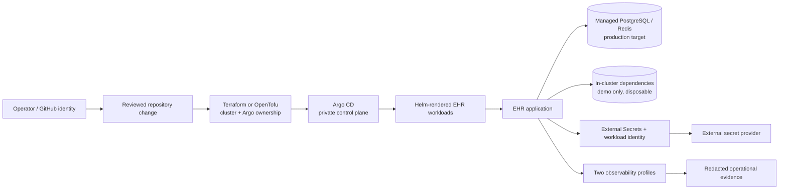

# DevSecOps platform reference

> **Reference configuration only.** This synthetic/non-clinical prototype is not deployed,
> clinically validated, or certified. Do not use real patient data, credentials, identifiers,
> secrets, certificates, or private keys here.

**Live URL: Not deployed — reference configuration only**

Expected future hostname pattern: `https://ehr.<env>.<your-domain>`; it is not an endpoint.

## Purpose and current boundary

This document is the operator-facing architecture skeleton for later platform tickets. It
does not add runnable Helm, Terraform/OpenTofu, Argo, policy, cloud, or secret-provider
configuration. The current implementation is the local Docker Compose stack: Caddy is the
only host-published service, while web/API, PostgreSQL, Redis, worker, and Beat stay on an
internal network. Compose migration and demo seeding are local startup behavior, not a
managed-cluster deployment claim.



## Intended repository map

The map is intentionally conceptual until later tickets supply implementations:

```text
platform/
  README.md
  docs/decisions/       ADR index and hard-to-reverse decisions
  docs/glossary.md      shared terms and boundaries
  docs/context.md       scope, assumptions, and validation posture
  tool-versions.json    existing offline tool contract
  validation-targets.json
  helm/                 future chart/library location (not implemented here)
  terraform/            future cluster-and-Argo location (not implemented here)
  gitops/               future Argo applications and environments (not implemented here)
```

## Operator paths

- **kind:** the first disposable end-to-end target for the demo profile. Bootstrap is
  expected to be ephemeral, bounded in retry, and idempotent in teardown.
- **k3s:** a constrained, self-managed path for a four-vCPU/eight-GB profile; capacity and
  observability limits must remain explicit and unmeasured until tested.
- **EKS, GKE, AKS:** documented provider alternatives. A later installation selects exactly
  one provider per installation; this reference does not claim that any provider path is
  implemented or cloud-tested.

All paths are expected to use Helm for workload packaging and Argo for reconciliation. A
failed migration is a rollout gate: the new workload is **not promoted**. Readiness failure
stops promotion and preserves **healthy capacity** where available. Bootstrap retries are
bounded and cleanup is idempotent; these are acceptance expectations, not measured results.

## Security, data, and logging boundaries

- Terraform/OpenTofu owns the cluster and Argo installation; GitOps owns application
  workloads and environment values. Neither boundary embeds application secrets.
- External Secrets retrieves references through short-lived workload identity; static cloud
  keys and committed secret values are prohibited.
- Administration, Argo, cluster APIs, dashboards, metrics, and data services remain private;
  only explicitly required application ingress may be public.
- Operational logs use a default-deny allowlist. Never emit EHI, identifiers, credentials,
  tokens, paths, clinical payloads, secret values, or raw subprocess/provider errors.
- Production targets managed PostgreSQL and Redis with provider-owned backup controls.
  Demo may use visibly lower-durability in-cluster dependencies and must be labeled
  disposable; it is not a production substitute.

## Reliability targets (unvalidated)

RPO, RTO, and SLO values are planning targets only until a named environment, workload,
backup policy, and repeatable evidence exist. No target below is a live guarantee:

| Profile | RPO target | RTO target | SLO posture |
| --- | --- | --- | --- |
| Demo/kind | best effort / disposable | best effort | local smoke signals only |
| k3s constrained | to be agreed with operator | to be agreed with operator | capacity-limited, unvalidated |
| Managed provider | to be agreed with provider backup tier | to be agreed with recovery runbook | target only; no measured claim |

Cost estimates are also pending. The intended method is a reviewed Infracost delta from a
synthetic Terraform plan, labeled as an estimate rather than a bill, with secrets excluded.

## Validation seams

The existing offline seam validates repository contracts without cloud credentials. Ticket02
documents kind bootstrap expectations; later seams should separately validate rendered Helm,
policy admission, Terraform scope, Argo sync, provider networking, secret retrieval,
observability, recovery, and cost evidence. Static, kind, k3s, cloud, and unvalidated
results must be classified separately. No endpoint, cloud account, or live recovery is
claimed by this document.

See the [decision index](docs/decisions/README.md), [glossary](docs/glossary.md), and
[context](docs/context.md).
