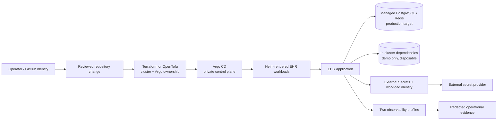
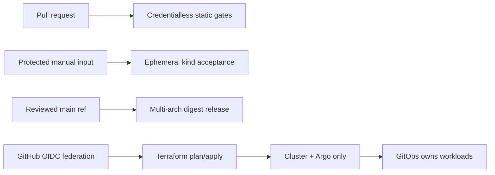

# DevSecOps platform reference

> **Reference configuration only.** This synthetic/non-clinical prototype is not deployed,
> clinically validated, or certified. Do not use real patient data, credentials, identifiers,
> secrets, certificates, or private keys here.

**Live URL: Not deployed — reference configuration only**

Expected future hostname pattern: `https://ehr.<env>.<your-domain>`; it is not an endpoint.

## Purpose and current boundary

This document is the operator-facing architecture reference. Ticket03 adds a reusable Helm library
and EHR application chart under `platform/helm/`; Ticket04 adds the single-repository Argo
app-of-apps and platform add-on desired state under `platform/gitops/`. Ticket06 adds reusable
Terraform/OpenTofu-compatible AWS, GCP, and Azure foundations under `platform/terraform/`. The current implementation
is still the local Docker Compose stack: Caddy is the only host-published service, while web/API,
PostgreSQL, Redis, worker, and Beat stay on an internal network. Compose migration and demo seeding
are local startup behavior, not a managed-cluster deployment claim.



## Intended repository map

The map is intentionally conceptual until later tickets supply implementations:

```text
platform/
  README.md
  docs/decisions/       ADR index and hard-to-reverse decisions
  docs/glossary.md      shared terms and boundaries
  docs/context.md       scope, assumptions, and validation posture
  tool-versions.json    existing offline tool contract
  validation-targets.json
  helm/ehr-library/     reusable labels, security, resource, and probe helpers
  helm/ehr/             EHR web/API/worker/Beat workloads and migration hook
  helm/bootstrap/       small one-Argo-per-cluster bootstrap chart
  gitops/               Argo applications, targets, policies, routes, and telemetry references
  terraform/            one-provider-per-install roots, modules, and backend examples
```

## Operator paths

- **kind:** the first disposable, ephemeral end-to-end target for the demo profile. Use
  `make kind-e2e` only after reviewing Docker availability; it creates a uniquely named
  cluster, builds/loads the current architecture images, creates synthetic secrets outside
  Git, runs migration and seed, checks web/API/worker/Beat health, and deletes only its own
  cluster. Bootstrap uses bounded retry and idempotent cleanup; the acceptance is opt-in and
  bounded; add-on registry failures are reported as blocked rather than passed.
- **k3s:** a constrained, self-managed path for a four-vCPU/eight-GB profile. Apply
  `platform/k3s/config.yaml` (or the credential-free cloud-init sketch) with a private
  firewall, operator-controlled DNS, and externally provisioned TLS. Bundled Traefik,
  ServiceLB, and metrics-server are disabled so Envoy Gateway owns ingress. This is not a
  cloud/VPS deployment claim and has no live URL.
- **EKS, GKE, AKS:** reusable provider alternatives in `platform/terraform/`. A later installation
  selects exactly one provider per installation; these modules are not cloud-tested here and never
  include credentials, state, plans, or secret values.

All paths are expected to use Helm for workload packaging and Argo for reconciliation. A
failed migration is a rollout gate: the new workload is **not promoted**. Readiness failure
stops promotion and preserves **healthy capacity** where available. Bootstrap retries are
bounded and cleanup is idempotent; these are acceptance expectations, not measured results.

## Security, data, and logging boundaries

- Terraform/OpenTofu owns the cluster and Argo installation; GitOps owns application
  workloads and environment values. Neither boundary embeds application secrets.
- External Secrets retrieves references through short-lived workload identity; static cloud
  keys and committed secret values are prohibited.
- Administration, Argo, cluster APIs, dashboards, metrics, and data services remain private;
  only explicitly required application ingress may be public.
- Operational logs use a default-deny allowlist. Never emit EHI, identifiers, credentials,
  tokens, paths, clinical payloads, secret values, or raw subprocess/provider errors.
- Production targets managed PostgreSQL and Redis with provider-owned backup controls.
  Demo may use visibly lower-durability in-cluster dependencies and must be labeled
  disposable; it is not a production substitute.

## Reliability targets (unvalidated)

RPO, RTO, and SLO values are planning targets only until a named environment, workload,
backup policy, and repeatable evidence exist. No target below is a live guarantee:

| Profile | RPO target | RTO target | SLO posture |
| --- | --- | --- | --- |
| Demo/kind | best effort / disposable | best effort | local smoke signals only |
| k3s constrained | to be agreed with operator | to be agreed with operator | capacity-limited, unvalidated |
| Managed provider | to be agreed with provider backup tier | to be agreed with recovery runbook | target only; no measured claim |

Cost estimates are also pending. The intended method is a reviewed Infracost delta from a
synthetic Terraform plan, labeled as an estimate rather than a bill, with secrets excluded.

## 2026-10-04 planning cost ranges (USD/month)

These dated ranges are planning estimates, not quotes or deployment evidence. Assumptions: 730
hours/month, on-demand public list pricing, one region, one cluster, one small managed PostgreSQL,
one small managed Redis, 100 GB block storage, and 100 GB monthly egress. They exclude support,
taxes, DNS/domain/TLS, extra backup retention, observability vendors, NAT, traffic variance, and
discounts. k3s assumes a 4-vCPU/8-GB VPS; cloud values are small-production envelopes, not equal
performance claims.

| Target | Monthly range | Official pricing facts used | Status |
| --- | ---: | --- | --- |
| k3s VPS, 4 vCPU / 8 GB | $40–$120 | Vendor/region VPS and block-storage list prices; operator must replace inputs | Estimate; not deployed |
| AWS EKS | $350–$1,100 | [EKS](https://aws.amazon.com/eks/pricing/), [EC2](https://aws.amazon.com/ec2/pricing/on-demand/), [RDS](https://aws.amazon.com/rds/pricing/), [ElastiCache](https://aws.amazon.com/elasticache/pricing/) | Estimate; no account tested |
| GKE | $300–$1,000 | [GKE](https://cloud.google.com/kubernetes-engine/pricing), [Compute](https://cloud.google.com/compute/pricing), [Cloud SQL](https://cloud.google.com/sql/pricing), [Memorystore](https://cloud.google.com/memorystore/pricing) | Estimate; no project tested |
| AKS | $300–$1,000 | [AKS](https://azure.microsoft.com/pricing/details/kubernetes-service/), [VM](https://azure.microsoft.com/pricing/details/virtual-machines/), [PostgreSQL](https://azure.microsoft.com/pricing/details/postgresql/flexible-server/), [Managed Redis](https://azure.microsoft.com/pricing/details/managed-redis/) | Estimate; no subscription tested |

Ranges express uncertainty; they do not claim quotes. Once configured, a pinned Infracost run over
the reviewed Terraform plan is authoritative. Cost levers are disposable k3s/demo profiles,
right-sized replicas/storage, lightweight telemetry, committed use after measured baselines, and
limited cross-zone/Internet egress. Never reduce private administration, backups, identity, or
image verification for savings.

## Validation seams

The existing offline seam validates repository contracts without cloud credentials. Ticket02
documents kind bootstrap expectations; Ticket04 adds static desired-state checks. Live Argo,
provider networking, secret retrieval, admission, observability, recovery, and cost evidence
remain unvalidated. Static, kind, k3s, cloud, and unvalidated results must be classified
separately. No endpoint, cloud account, or live recovery is claimed by this document.

## Ticket03 chart interface

The chart is a reference configuration and is **not deployed**. Build its local library
dependency before lint/rendering:

```sh
helm dependency build platform/helm/ehr
helm lint platform/helm/ehr
helm template ehr platform/helm/ehr
```

`environment: demo` and `environment: k3s` use local-path-compatible RWO storage, in-cluster
non-production PostgreSQL/Redis, one replica, disabled HPA/PDB/topology spreading on a single
node, and bounded worker concurrency; cloud profiles can select RWX storage and managed endpoints through values;
`environment: production` requires API and web image digests and rejects synthetic seeding. Secret
values are supplied by pre-existing Secret/ExternalSecret interfaces, never by chart values. The
chart intentionally emits no public Service or ServiceMonitor; Gateway and observability hooks are
Ticket04/Ticket06 boundaries.

See the [decision index](docs/decisions/README.md), [glossary](docs/glossary.md), and
[context](docs/context.md).

## Ticket07 delivery and credentialless gates

The workflows in `.github/workflows/` are reference automation and are **not deployed**.
`platform-validation.yml` is the default credentialless suite. `kind-integration.yml` is a
separately selected disposable suite: it creates a uniquely named cluster, loads current web/API
images, waits for web/API/worker/Beat and migration, then deletes only that cluster. A kind run is
Not Run unless its explicit manual input is selected; static validation never implies kind passed.



Cloud credentials are not stored as long-lived keys. AWS role ARN, GCP workload identity provider,
and Azure federated client ID are environment variables consumed only by an approved OIDC runner.
Plan artifacts are short-retention and are not uploaded for fork PRs. Apply requires a main-branch
dispatch, typed provider/environment allowlists, `APPLY` confirmation, and matching protected GitHub
environment approval. Release requires explicit manual gating, configured ECR/Artifact Registry/ACR,
immutable digests, Trivy, SBOM, Cosign keyless signature/attestation, and provenance. No workflow
performs a production deployment. Official action release references were checked on 2026-10-04;
Renovate maintains full-SHA pins. Missing optional tools or credentials are blocked/Not Run, never
 a successful estimate or deployment claim.

## Evidence classification and operator runbooks

Acceptance records include input revision, profile, architecture, timestamp, expected/actual result,
and exact status. `Static` is credentialless source/rendered evidence; `kind` is an explicitly
selected disposable cluster; `k3s` and `cloud` require named-environment evidence; `Not Run` is not
a pass. The application has health signals but no native Prometheus metrics endpoint, so external
edge/black-box and workload/kube-state monitoring cover availability while application task success
remains limited and unvalidated.

See [`platform/docs/runbooks.md`](docs/runbooks.md) for local kind, k3s, cloud state/bootstrap,
Argo recovery, rollback, RPO15m/RTO4h backup/restore targets, secret rotation, incident/log safety,
certificate/DNS, monitoring, upgrades, and scoped teardown safeguards.
