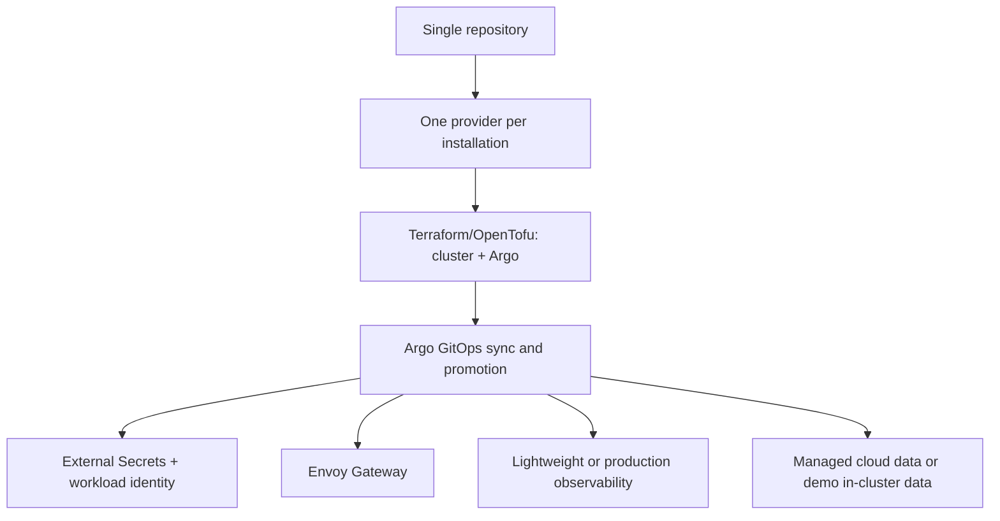

# Platform decision index

**Live URL: Not deployed — reference configuration only**

This index records confirmed architecture choices for the synthetic reference platform. The
ADRs are intentionally limited to hard-to-reverse boundaries. They do not certify security,
availability, interoperability, clinical safety, or cloud readiness.

## Confirmed choices

| ADR | Choice | Main consequence | Reconsider when |
| --- | --- | --- | --- |
| [001](adr-001-single-repository.md) | Single repository platform | Cross-cutting reviews are centralized | ownership or isolation requires separate release units |
| [002](adr-002-one-provider-per-installation.md) | One provider per installation | Provider modules stay explicit | portability requires simultaneous multi-provider operation |
| [003](adr-003-terraform-argo-boundary.md) | Terraform/OpenTofu owns cluster + Argo; Argo owns workloads | No direct workload apply | platform ownership or lifecycle needs change |
| [004](adr-004-gitops-sync-promotion.md) | Git is desired state; dev/stage auto-sync, production gated | Promotion is reviewable and auditable | emergency or regulated change process requires another gate |
| [005](adr-005-external-secrets-workload-identity.md) | External secret references and short-lived identity | No static keys in repo/workloads | provider cannot supply the required identity boundary |
| [006](adr-006-envoy-gateway.md) | Envoy Gateway at application ingress | Gateway policy is centralized | required protocol or support boundary changes |
| [007](adr-007-observability-profiles.md) | Lightweight and production observability profiles | constrained environments get bounded telemetry | measured workload needs exceed profile limits |
| [008](adr-008-managed-versus-demo-data.md) | Managed cloud data for production; in-cluster data for demo | durability expectations are explicit | demo needs durable recovery or provider constraints change |
| [009](adr-009-multi-cloud-terraform.md) | Reusable one-provider Terraform foundations | isolated roots and private managed services | provider support or ownership boundary changes |

## Shared consequences and exclusions

These choices require explicit ownership, private administration paths, redacted default-deny
logs, immutable evidence classification, and separate demo/managed data warnings. Ticket06 adds
provider modules without credentials or cloud claims; it does not promise multi-region recovery or
measured RPO/RTO/SLO. EKS, GKE, AKS, k3s, and kind
remain targets with validation status recorded separately; no live-cloud target has been
validated here.

## Alternatives, status, and reconsideration

The nine entries above are **Accepted** reference decisions, not deployment approvals. Alternatives
were rejected where they blur identity/state ownership (multi-provider installs), bypass review
(direct Terraform workload applies), outlive workload identity (static secrets), or exceed the
k3s budget (one heavy telemetry profile). A separate repository, gateway, or provider-native
GitOps controller may be reconsidered only with preserved ownership, rollback, private-admin, and
evidence contracts. Record a replacement ADR before changing manifests, and reconsider only when
the row's condition is evidenced. Provider, recovery, cost, and application-metrics claims remain
unvalidated until named-environment evidence exists.

## Ticket07 CI supply-chain decision

<!-- type-10042026-Maurice -->

GitHub Actions is the credentialless review boundary: least-privilege permissions, full commit-SHA
action pins, bounded timeouts/artifacts, Renovate grouping, and no `pull_request_target`. OIDC is
the only cloud identity path. Terraform may plan/apply only the selected provider's cluster and
Argo foundation; GitOps owns application workloads. Apply requires protected environment approval,
main ref, typed allowlists, and explicit `APPLY` confirmation. Release is manual, multi-architecture,
digest-addressed, scanned, SBOM-producing, keylessly signed/attested, and does not deploy.

The default suite is static and credentialless. Kind is a separately selected live suite; its
absence is recorded as Not Run rather than converted into a pass. This remains a synthetic reference
configuration and is **Not deployed**.
