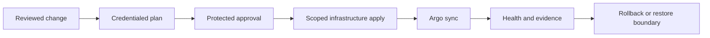

<!-- type-10042026-Maurice -->
# Platform operator runbooks

**Live URL: Not deployed — reference configuration only**

These procedures operate only on a named, authorized environment. The repository is synthetic and
non-clinical; do not place credentials, state, identifiers, payloads, certificates, or private keys
in Git or logs.

## Local kind

1. Check Docker, free ports, and image build prerequisites; choose a unique cluster name.
2. Use the opt-in kind workflow or `make kind-e2e` after reviewing its command and values.
3. Create synthetic secrets outside Git, run the migration PreSync-equivalent and optional demo
   seed, then verify web/API readiness plus worker and Beat health.
4. Classify the result as `kind`; add revision, profile, timestamp, expected/actual result, and
   status. Registry/add-on outage is `Blocked` or `Not Run`, never a pass.
5. Delete only the named cluster after evidence capture. Never use broad Docker prune commands.

## k3s (4 vCPU / 8 GB target)

Review `platform/k3s/config.yaml`, private firewall, operator DNS, and externally provisioned TLS.
Disable bundled Traefik/ServiceLB/metrics-server as configured; verify Envoy owns application edge,
data services remain private, and resource requests/concurrency fit the constrained profile. Apply
only from an authorized runner and record `k3s` evidence; this repository does not claim a VPS run.

## Managed cloud state and bootstrap

Select exactly one provider and one environment root. Before any command, confirm account/project,
region, state key, protected identity, and change ticket. Create encrypted/versioned remote state
with native locking using the matching `backend.hcl.example` copied outside Git. Run `terraform
fmt -check`, `terraform init -backend=false`, and `terraform validate` before credentialed init.
Plan, review the artifact, and apply only after protected approval; Terraform owns cluster and Argo
bootstrap, while Argo owns workloads. Never fall back to local state or apply a plan from another
environment. AWS EKS, GKE, and AKS are reference alternatives and remain unvalidated here.

## Argo bootstrap, recovery, and rollback

Install the pinned Argo chart privately, apply the root application, and inspect sync waves and
health before enabling target applications. A failed migration blocks promotion; readiness failure
preserves healthy capacity. For drift, fix Git, review, sync the revision, and retain the revision
in evidence—do not mutate production directly. Application rollback cannot reverse an irreversible
schema migration: stop promotion, follow the data recovery procedure, and involve the owner.

## Backup and restore (RPO15m / RTO4h targets)

These are planning targets, not measured guarantees. Production backup/PITR ownership belongs to
the managed PostgreSQL/Redis provider; verify cadence, retention, encryption, region, and restore
permissions in that provider. Run a synthetic restore rehearsal, measure backup age and elapsed
restore time, validate migration compatibility and health, then record evidence. Demo/in-cluster
data is disposable and must not be treated as a backup. Do not delete or overwrite live data during
a rehearsal; use a separately named restore target and explicit approval.

## Secret rotation and incident/log safety

Rotate provider secrets through the external secret store and workload identity, then restart only
the named workloads and verify readiness. Revoke old material after overlap and record references,
not values. During incidents capture event category, status, severity, correlation token, and
revision only. Do not log EHI, identifiers, tokens, paths, payloads, secret values, or raw provider
errors. Preserve audit-chain and immutable medication evidence; quarantine suspicious artifacts.

## Certificate and DNS

Use an approved certificate issuer and private DNS/control-plane records; validate SAN, expiry,
renewal, chain, and private-edge reachability before changing ingress. DNS cutover requires a low
TTL plan, rollback record, and health checks. Never commit certificates or keys. Local kind uses
synthetic/local trust only and is not a public endpoint.

## Monitoring and alerts

Use external edge/black-box checks and workload/kube-state signals for availability, migration,
rollout, worker/Beat, database, cache, certificate, and capacity alerts. The current application
has no native Prometheus metrics endpoint, so task-success and clinical workflow latency are not
measured. Keep alert payloads redacted and bounded; classify unmeasured signals as `Not Run`.

## Upgrade and compatibility

Review pinned Terraform/OpenTofu, provider, Helm, Argo, Kubernetes, image, and policy versions.
Render and validate in a disposable profile, run migration compatibility checks, then upgrade one
named environment at a time with a maintenance/rollback plan. Record unsupported provider feature
or Azure Redis availability as a blocker, not a successful compatibility result.

## Teardown safeguards

Preview scope with `terraform plan` or `docker compose config`; verify project, cluster, state key,
and operator approval. For disposable local resources only, use the named Compose project or unique
kind cluster cleanup. `docker compose down --volumes --remove-orphans` is destructive and allowed
only for that intentionally disposable project after explicit confirmation. Never use `docker
system prune`, broad volume deletion, wildcard cloud deletion, or shared-cluster cleanup.
