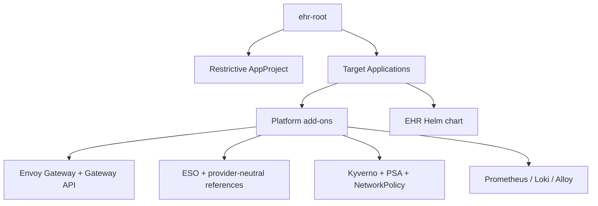

# GitOps desired state

> **Reference configuration only.** This synthetic/non-clinical prototype is not deployed or clinically validated.
> No credentials, domains, certificates, identifiers, or patient data are present.

**Live URL: Not deployed — no cluster is claimed.**

`ehr-root` is a single-cluster app-of-apps entry point. Demo/kind, k3s, development, and staging
auto-sync and self-heal with bounded pruning. Production has no automated sync and has deletion/prune
guards; promotion requires the `approved-release` gate. The namespace set is isolated per target.

Migration jobs are PreSync gates. Application rollback does not claim to reverse irreversible schema
migrations; use the documented recovery process instead. Metrics and logs are bounded profile targets,
not measured SLOs. The current EHR application has no native Prometheus endpoint; endpoint health is
represented by Envoy/blackbox and workload/kube-state signals, so task-success observability remains
unvalidated.
