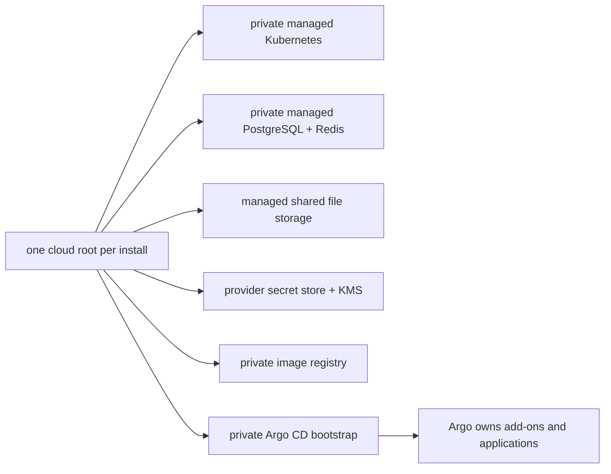

<!-- type-10042026-Maurice -->
# Multi-cloud Terraform foundations

> **Reference configuration only.** This synthetic/non-clinical prototype is not deployed,
> clinically validated, or certified. Never put credentials, state, plans, patient data, or
> secret values in this directory.

**Live URL: Not deployed — reference configuration only**

Terraform 1.9.8 is primary; the syntax is intentionally compatible with OpenTofu 1.8.x where
provider behavior permits. Each installation selects exactly one provider root. Remote state is
bootstrapped separately by an authorized operator using the provider's encrypted, versioned,
access-controlled backend and native locking/lease. Backend configuration files are examples only.

Terraform owns infrastructure and Argo owns every other add-on and workload.

Modules expose a common output vocabulary without returning passwords or secret values. Terraform
owns infrastructure and only the pinned Argo Helm release/root Application. Argo owns every other
add-on and workload. Cloud plan/apply requires an approved identity and is intentionally not run by
repository validation. Provider data services are private; application ingress is the only intended
public edge.

## Layout and usage

* `modules/aws`, `modules/gcp`, and `modules/azure` are reusable, provider-native modules.
* `environments/<provider>/<environment>` are isolated roots with distinct state keys.
* Copy the matching `backend.hcl.example` outside Git, fill only operator-controlled identifiers,
  then run `terraform init -backend-config=/path/to/backend.hcl` from an authorized runner.
* Set `bootstrap_argo = false` for offline validation or until the private cluster endpoint is
  reachable from the approved network runner.

Production defaults enable multi-zone placement, encryption, backups/PITR where the provider
supports it, and deletion protection. RPO15m/RTO4h are design targets, not measured guarantees;
provider backup cadence, restore duration, quotas, and regional failure behavior remain limitations.
Azure Managed Redis is represented by the current `azurerm_managed_redis` resource; verify the
selected AzureRM lockfile version supports that resource before an authorized plan.
