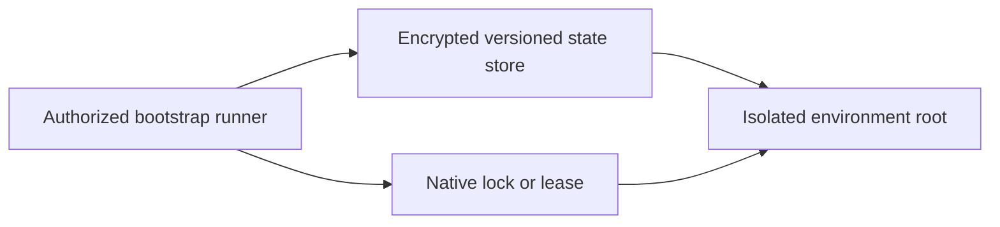

<!-- type-10042026-Maurice -->
# Remote-state bootstrap contract

> **Reference configuration only.** This synthetic/non-clinical prototype is not deployed and
> contains no credentials, state, plans, identifiers, or secret values.

**Live URL: Not deployed — reference configuration only**

State bootstrap is intentionally a separate operator-owned step; the cluster modules must never
create their own backend or fall back to local state. Use the provider's native controls:

| Provider | Store controls | Locking / lease | Isolation |
| --- | --- | --- | --- |
| AWS | S3 versioning, SSE-KMS, public access block, TLS-only bucket policy, least-privilege IAM | DynamoDB lock table | `ehr/<cloud>/<environment>/terraform.tfstate` |
| GCP | GCS object versioning, uniform bucket IAM, CMEK where required, retention policy | GCS generation preconditions | `ehr/<cloud>/<environment>` prefix |
| Azure | Blob versioning, soft delete, private storage endpoint where feasible, Entra-only auth | Azure Blob lease | `ehr/<cloud>/<environment>.tfstate` |

Populate the matching environment `backend.hcl.example` outside Git and run `terraform init` only
from an approved identity/network runner. Backend initialization, plan, apply, and restore are not
run by this repository. Lock contention or backend outage must fail closed; no local-state fallback
is supported. Cross-region replication, provider-specific retention cost, and restore timing remain
unvalidated limitations.
